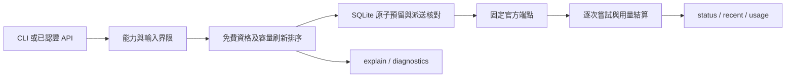

# 七家 API v1.0 本地工程候選

## 範圍

v1.0 採用一個 Gateway、SQLite 與同一套 CLI/API。七家代表能力已有[真實成功證據](v1-seven-provider-readiness.md)，本階段只完善本地框架：零新 provider 呼叫、零 key 讀取、零 Doppler 操作、無部署／服務變更／push／merge／release。沒有修改套件版本或建立 tag。

本階段人類來源為 main `01a0de5f-8306-71a3-9738-7ac6eb4d7746`，UTC 2026-10-02 07:07:17.101 的「那我們就以這七家當作我們這系統的 1.0 然後先把系統框架完善一下吧」，由既定 orchestrate 交回原 task；起點 `feat/seven-provider-v1`／`3dbb64e`。原核心與歷史帳務保留。

## 單一路徑



| Provider | v1 代表模型／能力 | secret 名稱 |
| --- | --- | --- |
| NVIDIA | `nvidia/nemotron-3.5-lightning-30b-a3b`，LLM | `NVIDIA_API_KEY` |
| Gemini（provider=`google`） | `gemini-3.5-flash-lite`，LLM | `GEMINI_API_KEY` |
| Groq | `openai/gpt-oss-20b`，LLM | `GROQ_API_KEY` |
| Mistral | `ministral-3b-latest`，LLM | `MISTRAL_API_KEY` |
| Cloudflare | `@cf/meta/llama-3.2-1b-instruct`，LLM | `CLOUDFLARE_API_TOKEN`、`CLOUDFLARE_ACCOUNT_ID` |
| OpenRouter | `liquid/lfm-2.5-2.6b:free`，LLM | `OPENROUTER_API_KEY` |
| OCR.space | `ocr.space/engine2`，單圖 OCR | `OCRSPACE_API_KEY` |

NVIDIA Riva 的 `translation` 契約保留，必須是支援語言且含英文的一對語言；Gemma與Mistral Small仍保留為獨立模型。新增3B範例與Small使用同一placeholder帳戶／shared scope／quota buckets，不能以模型切換繞開帳戶限額。十個example targets全部disabled、free_eligible=false；歷史bucket/account身份及live profile未改。

## 準備與啟動契約

沿用 `uv sync --locked`，複製 `gateway.example.json` 至ignored local config，僅填入已核對的帳戶Free資格、billing狀態、model access、scope、quota與期限。公開模型資料／過去成功都不能替代當前帳戶證據。`local_safety_caps` 是操作上限，official remaining未知時維持null。

`gateway-serve` 需要 `--config`、`--db`、`--digest-key-file`、`--client-token-file`、`--doppler-token-file`、`--doppler-project`、`--doppler-config`；port預設18084，僅loopback。digest key至少32 bytes且重啟沿用，client bearer token至少32字元。runtime Doppler credential須獨立準備；先前一次性5分鐘驗證token不是常駐憑證。本階段未準備秘密檔案或啟動常駐服務。

### 可選的秘密名稱清單

`--secret-names-file`讀既有、人工核對且有期限的名稱metadata，啟動時載入，不自動刷新或查Doppler。格式如下，時間是歷史示例，不能作當前就緒證據：

```json
{
  "project": "api-quota-broker",
  "config": "dev",
  "names": ["GROQ_API_KEY", "MISTRAL_API_KEY"],
  "verified_at": "2026-10-02T07:00:00+00:00",
  "expires_at": "2026-10-02T07:05:00+00:00"
}
```

清單必須完整列出該scope已核對的名稱；未列名稱在有效期內會被視為missing。只接受這五個欄位、最多256個唯一大寫名稱；拒絕values欄位與其他scope。過期、未來或未提供清單時，名稱狀態為unknown；保留既有dispatch-time resolver，不用未知清單直接宣稱缺key。有效清單缺名稱時，explain顯示`credential_name_missing`，run在讀key前排除該target。名稱present不證明key有效或權限有效。

## 日常 CLI／API

以下CLI假設使用者已啟動已核對設定的Gateway；查詢不讀provider key、不呼叫provider。client token仍須經檔案或stdin提供，不寫入argv。所有API必須帶client bearer認證，回應`Cache-Control: no-store`。

```sh
uv run --locked quota-broker gateway --token-file /protected/client-token catalog
uv run --locked quota-broker gateway --token-file /protected/client-token diagnostics
uv run --locked quota-broker gateway --token-file /protected/client-token recent --limit 20 --state unknown
uv run --locked quota-broker gateway --token-file /protected/client-token --json usage --provider mistral
uv run --locked quota-broker gateway --token-file /protected/client-token status opaque-request-id
```

| 功能 | API | 意義 |
| --- | --- | --- |
| catalog | GET `/v1/catalog` | 模型、能力、帳戶證據與local caps |
| diagnostics | GET `/v1/diagnostics` | 最小本地admission、缺secret名稱／evidence、冷卻與共享限額 |
| explain | POST `/v1/routes/explain` | 對實際任務核對能力、長度、上限與候選順序；不派送 |
| run | POST `/v1/tasks` | 預留、受控派送、回傳一次answer與入庫metadata |
| recent | GET `/v1/tasks?limit=20&before=opaque-id&provider=mistral&state=unknown` | 最近任務／每次attempt；limit為1..100，預設20 |
| status | GET `/v1/tasks/{request_key}` | 同一任務的持久化metadata，沒有answer |
| usage | GET `/v1/usage?provider=mistral&from=2026-10-02T00:00:00Z&to=2026-10-03T00:00:00Z` | 每次派送的actual、estimate、unknown與holds；時間區間為[from,to) |

`diagnostics` 是一個input token、一個output token，以及適用時一個Neuron的本地最低admission快照。`ready`不保證實際長度、餘額、key有效性或provider健康。`unknown`表示名稱證據未核對；`blocked`可列disabled、Free證據缺失／過期、billing、official remaining=0、local cap、冷卻、concurrency、舊identity待核對等原因。快照可能保守保留尚未由下一次reserve清除的expired-unsent reservation；不透過查詢改帳。

`recent`按created_at／request_key降冪穩定分頁，`next_before`供下一頁；provider/model指最後選用target，先前fallback attempts仍完整附在任務中。state過濾採與status相同的ledger解讀，崩潰邊界的preparing/dispatched若ledger可能已派送則呈unknown。列表、status、usage、diagnostics只讀SQLite，不讀秘密或provider；`explain`沿既有admission流程可清除過期且尚未送出的reservation，但不派送。

### 任務輸入

`run`與`explain`使用相同JSON；CLI從stdin讀input。request_key必須是不含內容的opaque URI-safe id，同key／同payload只讀既有結果；不同payload回409。

- LLM：`capability=text_generation`、非空text、最多32,768 UTF-8 bytes、max_output_tokens 1..4096且符合target上限。provider/model可以省略，讓Gateway選；Cloudflare若是候選需保守且已核對的positive neuron_bound，未提供時該路由不匹配。
- translation：`capability=translation`、source_language／target_language、非空text最多1952字元，目前Riva要求英文在其中一側。
- OCR：`capability=ocr`、input為base64單張PNG/JPEG，解碼後最多36,000 bytes；max_output_tokens省略或1。CLI目前直接讀base64文本，不解析路徑／多頁PDF、不上傳其他檔案。

核對後的CLI派送示例（執行run會呼叫供應商，本階段沒有執行）：

```sh
printf '請只回答一個簡短詞。' | uv run --locked quota-broker gateway --token-file /protected/client-token --json explain --request-key dry-run-1 --capability text_generation --max-output-tokens 64
printf '請只回答一個簡短詞。' | uv run --locked quota-broker gateway --token-file /protected/client-token --json run --request-key unique-task-1 --capability text_generation --max-output-tokens 64
```

## 路由與帳務邊界

1. 能力、provider/model限制、輸入context、output界限與Free資格先過濾；合格short_renewable依refresh_seconds由短到長，再unknown、one_time_gift，priority／target ID打破平手。過期capacity evidence降為unknown。
2. SQLite `BEGIN IMMEDIATE`核對共享bucket與concurrency，reserve與dispatch再次查資格／冷卻／snapshot。最多嘗試三個target；secret取得或建構請求的確證送出前失敗可換target。
3. 派送後只有既有、文件支持且無usage／partial的quota非執行拒絕才能fallback。所有provider有安全HTTP類別與`non_execution_quota_proven`旗標；旗標來自既有嚴格quota classifier，錯誤提示不會擴張判斷。Mistral Small429/code1300本身不滿足fallback。
4. timeout、未知、202、5xx、含partial的拒絕均不換家／重播；restart與同key也不重送。已送出unknown保留估算hold，人工核對前不釋放。
5. usage按所有已派送attempt累計；quota拒絕保留attempt及零usage結算。reported tokens／Neurons與estimated input／ledger charge分開，OCR只有image bytes與request usage。Cloudflare缺可信Neurons仍保留hold，不能把估算當actual。
6. `completed`是執行／用量狀態；length是截斷而非完整回答，可信用量仍正常結算。first call才回answer；查詢／同key都無內容。秘密、input、answer、raw response不進SQLite／正常日誌；error只存安全類別／白名單metadata。

原DB的欄位遷移為additive、可重入；歷史列與bucket/account身份保持。沒有匯入或改寫舊live receipts。七家代表能力成功不等於每個模型全通、未來配額、OCR實際文件品質或已部署。Small429確切bucket、舊Gemma逾時原因、Cloudflare歷史Neurons仍未定。

## 本階段驗證

Ubuntu完整`pytest -q` **312 passed in 46.37s**，含本階段39項新契約案例。`ruff check .`、`ruff format --check .`（61 files）、`mypy src/quota_broker`（15 source files）及`git diff --check`通過。離線測試涵蓋七家代表模型無provider限制派發、LLM／translation／OCR、refresh排序、quota拒絕fallback的HTTP／CLI／SQLite一致性、unknown與crash gap重啟不重播、metadata查詢不讀secret、不落內容、穩定分頁／filters、Free證據與冷卻、舊欄位相容；回應均為fixture。

回歸期間修正diagnostics對既有charge rows缺SQLite Row factory的503；另分開Gateway只讀status與歷史broker的unsent-expiration處理，加hash不改帳驗證。沒有改quota判定或放寬fallback。原十份live DB對既有hash一致；加上3B正式成功收據，本階段共十一份live DB保持不變。沒有新增診斷腳本、秘密檔案、live請求或服務。
